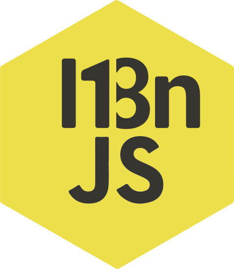

# I18njs



[i18njs](https://www.npmjs.com/package/@k14v/i18njs) it's made to intended simplify and normalize internationalization and make compatible with all kind of javascript environments.

----

# Getting started
```shell
$ npm install --save @k14v/i18njs
```

# Setup
```javascript
const i18n = i18njs({
  locales: {
    es: {
      'esto es una prueba': 'Esto es una prueba',
      'Teléfono': 'Teléfono',
      'Perro': 'Perro',
    },
    en: {
      'esto es una prueba': 'This is a test',
      'Teléfono': 'Phone',
      'Perro': 'Dog',
    },
    de: {
      'esto es una prueba': 'Das ist ein Test',
      'Teléfono': 'Telefon',
      'Perro': 'Hund',
    },
  },
});

i18n.on('loading', ({ locale }) => {
  console.log(`loading locale: ${locale}`);
  // output: loading locale:
});

i18n.on('loaded', ({ locale }) => {
  console.log(`loaded locale: ${locale}`);
});

i18n.setLocale('en').then(trls => {
  console.log(trls.__('esto es una prueba'));
  // output: this is a test
  console.log(trls.__('Teléfono'));
  // output: Phone
});

i18n.setLocale('de').then(trls => {
  console.log(i18n.trls.__('esto es una prueba'));
  // output: Das ist ein Test
  console.log(i18n.trls.__('Teléfono'));
  // output: Telefon
});
```

# Handling events


# Using translators

```javascript
trls.__('esto es una prueba')
```
